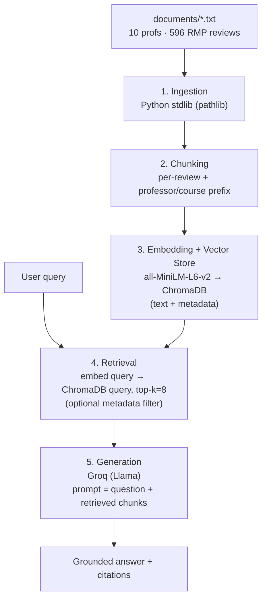

# Project 1 Planning: The Unofficial Guide

> Write this document before you write any pipeline code.
> Your spec and architecture diagram are what you'll use to direct AI tools (Claude, Copilot, etc.) to generate your implementation — the more specific they are, the more useful the generated code will be.
> Update the Retrieval Approach and Chunking Strategy sections if you change your approach during implementation.
> Update this file before starting any stretch features.

---

## Domain

<!-- What domain did you choose? Why is this knowledge valuable and hard to find through official channels? -->

**Course and professor reviews for the Northeastern University Computer Science department.**

This knowledge is valuable and hard to find through official channels because the university's official catalog only publishes course _descriptions_ — the formal topics covered. It says nothing about the things students actually decide on: how a specific professor teaches, how harsh the grading is, the real workload, whether a hard course is worth it, and which professor to pick for the same course. That experiential knowledge is crowd-sourced and scattered across review sites; the university has no incentive to publish it. I focus on one department (CS) rather than spreading across campus so the corpus is _dense_ — every query has many relevant documents to draw from, which is what makes retrieval useful.

---

## Documents

<!-- List your specific sources: URLs, subreddit names, forum threads, or file descriptions.
     Aim for at least 10 sources that together cover different subtopics or perspectives within your domain. -->

| #   | Source          | Description         | URL or location                                    |
| --- | --------------- | ------------------- | -------------------------------------------------- |
| 1   | RateMyProfessor | akshar varma        | https://www.ratemyprofessors.com/professor/3034822 |
| 2   | RateMyProfessor | Kaan Onarlioglu     | https://www.ratemyprofessors.com/professor/2338287 |
| 3   | RateMyProfessor | Mark Fontenot       | https://www.ratemyprofessors.com/professor/2868024 |
| 4   | RateMyProfessor | Lucia Nunez         | https://www.ratemyprofessors.com/professor/2668761 |
| 5   | RateMyProfessor | Justin Wang         | https://www.ratemyprofessors.com/professor/2963762 |
| 6   | RateMyProfessor | Karl Lieberherr     | https://www.ratemyprofessors.com/professor/430930  |
| 7   | RateMyProfessor | Gregory Aloupis     | https://www.ratemyprofessors.com/professor/2903924 |
| 8   | RateMyProfessor | Andrew van der Poel | https://www.ratemyprofessors.com/professor/2574535 |
| 9   | RateMyProfessor | Hongyang Zhang      | https://www.ratemyprofessors.com/professor/2689314 |
| 10  | RateMyProfessor | Joydeep Mitra       | https://www.ratemyprofessors.com/professor/2948118 |

---

## Chunking Strategy

<!-- How will you split documents into chunks?
     State your chunk size (in tokens or characters), overlap size, and explain why those
     numbers fit the structure of your documents.
     A review-heavy corpus warrants different chunking than a long FAQ. -->

**Chunk size:** One review per chunk (variable length, ~50–200 tokens; capped at ~256 tokens to absorb the rare long review).

**Overlap:** 0 tokens.

**Reasoning:** My documents are collections of short, self-contained student reviews (~55 tokens each), not flowing prose. So I chunk _per review_ rather than by a fixed token count: each chunk is exactly one student's opinion about one course. A fixed 500-token window would cram ~8–9 unrelated reviews — different courses, semesters, and contradictory sentiments — into a single chunk, producing a blurry "average" embedding that matches everything weakly and nothing precisely, and would also slice through individual reviews. Overlap is 0 because reviews are independent units — there is no argument flowing across a boundary to preserve. Critically, each chunk is **prefixed with the professor name, department, course code, and ratings** (e.g. `Hongyang Zhang — CS, DS4400 (Quality 4/5, Difficulty 1/5):`) so it stays attributable and searchable after being separated from its source file; without this, a chunk like "freest A of my life, learned nothing" loses all reference to who and what it describes.

---

## Retrieval Approach

<!-- Which embedding model are you using (e.g., all-MiniLM-L6-v2 via sentence-transformers)?
     How many chunks will you retrieve per query (top-k)?
     If you were deploying this for real users and cost wasn't a constraint, what tradeoffs
     would you weigh in choosing a different embedding model — context length, multilingual
     support, accuracy on domain-specific text, latency? -->

**Embedding model:** `all-MiniLM-L6-v2` via `sentence-transformers`, run locally (free, 384-dimensional, fast on short English text). Embeddings are local; the Groq API key is used only for generation, not embedding (Groq has no embeddings endpoint).

**Top-k:** 8 (tuned during evaluation). I retrieve more than the typical 5 because each chunk is a single short review — to answer a question like "is CS3000 hard?" the system needs several student opinions to form a consensus, and since chunks are tiny (~55 tokens) even top-8 is only ~450 tokens of context, which is cheap to pass to the LLM with low noise.

**Production tradeoff reflection:** If cost were not a constraint, I would prioritize **accuracy on domain-specific text** above all else. `all-MiniLM-L6-v2` is a small, general-purpose model; student reviews use slang, course codes (CS3000), and implicit sentiment ("freest A of my life" = easy) that a more capable model embeds more faithfully. I would evaluate a larger general model such as `all-mpnet-base-v2` or a commercial embedding API (e.g. Voyage, OpenAI text-embedding-3). The main counterweight is **latency** — larger models embed and retrieve more slowly, which matters for a real-time query interface, so I would weigh accuracy gains against response time. **Multilingual support** is not relevant here: the corpus is entirely English, so a multilingual model would spend capacity I do not need. **Context length** is also a non-issue _specifically because of my per-review chunking_ — my chunks are ~55 tokens, far below any embedding model's window; it would only matter if I embedded whole documents.

---

## Evaluation Plan

<!-- List your 5 test questions with their expected correct answers.
     Questions should be specific enough that you can judge whether the system's response
     is right or wrong. "What are good dining halls?" is too vague.
     "What do students say about wait times at [dining hall name] during lunch?" is testable. -->

| #   | Question                                                                                 | Expected answer                                                                                                                                                                |
| --- | ---------------------------------------------------------------------------------------- | ------------------------------------------------------------------------------------------------------------------------------------------------------------------------------ |
| 1   | Who is the better professor for CS1800 at Northeastern — Gregory Aloupis or Lucia Nunez? | Lucia Nunez (3.6/5 overall, 66% would take again). Gregory Aloupis is 1.6/5, only 18% would take again, difficulty 4.6/5. Take Nunez; avoid Aloupis.                           |
| 2   | What grades do students report getting in Akshar Varma's CS3000?                         | Polarizing — among self-reported letter grades, A is most common (~33), but there are also notable Fs (~8) and several Incompletes; many are N/A. It is not a reliable easy A. |
| 3   | How difficult is Akshar Varma's CS3000?                                                  | Very hard — the large majority rate it 5/5 difficulty (76 of ~117 reviews), average ≈ 4.4/5.                                                                                   |
| 4   | Is Mark Fontenot's CS3200 worth taking?                                                  | Mixed/polarizing — ~2.8/5 quality and only ~49% would take again. No clear recommendation; depends on the student.                                                             |
| 5   | For Mark Fontenot, do students rate CS3200 or CS3500 more highly?                        | Roughly equal — CS3200 ≈ 2.8/5 and CS3500 ≈ 2.7/5. Both mediocre; no meaningful difference (a system should not invent a winner).                                              |

---

## Anticipated Challenges

<!-- What could go wrong? Name at least two specific risks with reasoning.
     Consider: noisy or inconsistent documents, missing source attribution, off-topic
     retrieval, chunks that split key information across boundaries. -->

1. **Single-source selection bias.** All data comes from Rate My Professors, which self-selects for students with strong opinions — the very happy and the very angry. The corpus skews polarized (e.g., Akshar Varma's reviews swing between "great, understanding" and "disorganized, unengaging"), so the system may overstate how extreme a professor is and miss the median student's experience.

2. **Confident answers for out-of-corpus professors.** Only 10 of Northeastern's 100+ CS professors are in the corpus. The risk is not just missing data — it is that the system may answer _confidently_ about a professor it has no data for, retrieving the nearest-but-irrelevant chunks instead of saying "I don't have information on them." Mitigation: a similarity-score threshold that falls back to "not enough data."

3. **Cross-course bleed for multi-course professors.** Mark Fontenot has reviews for CS3200, CS3500, _and_ DS4300; Akshar Varma for CS3000 and DS3000. A query about one course may retrieve reviews about a _different_ course by the same professor, because the embedding can latch onto the professor's name. This is why each chunk is prefixed with its course code and why I store `course` as metadata for optional filtering — both reduce this bleed.

---

## Architecture

<!-- Draw a diagram of your pipeline showing the five stages:
     Document Ingestion → Chunking → Embedding + Vector Store → Retrieval → Generation
     Label each stage with the tool or library you're using.
     You can use ASCII art, a Mermaid diagram, or embed a sketch as an image.
     You'll use this diagram as context when prompting AI tools to implement each stage. -->

Stages 1–3 run **once** (offline indexing); stages 4–5 run **per query** (the live path).



```
┌───────────────────────────────────────────────────────────┐
│  documents/*.txt   (10 professors, 596 RMP reviews)         │
└──────────────────────────────┬────────────────────────────┘
                               │
              ┌────────────────▼────────────────┐
              │  1. DOCUMENT INGESTION           │   ─┐
              │  Python stdlib (pathlib)         │    │
              └────────────────┬────────────────┘    │
              ┌────────────────▼────────────────┐    │ runs once
              │  2. CHUNKING                     │    │ (offline
              │  per review + prof/course prefix │    │  indexing)
              └────────────────┬────────────────┘    │
              ┌────────────────▼────────────────┐    │
              │  3. EMBEDDING + VECTOR STORE     │    │
              │  all-MiniLM-L6-v2 → ChromaDB     │   ─┘
              │  text + metadata{prof,course,...}│
              └────────────────┬────────────────┘
                               │
   user query ─────────────────│
        │                      │
        ▼                      ▼
┌──────────────────────────────────────────────┐   ─┐
│  4. RETRIEVAL                                  │    │
│  embed query → collection.query(), top-k=8     │    │ runs per
│  (optional metadata where-filter)              │    │ query
└──────────────────────────┬───────────────────┘    │ (live
              ┌────────────▼────────────────────┐    │  path)
              │  5. GENERATION                   │    │
              │  Groq (Llama) via `groq`         │    │
              │  prompt = question + chunks      │   ─┘
              └────────────────┬────────────────┘
                               ▼
                      answer + citations
```

---

## AI Tool Plan

<!-- For each part of the pipeline below, describe:
     - Which AI tool you plan to use (Claude, Copilot, ChatGPT, etc.)
     - What you'll give it as input (which sections of this planning.md, which requirements)
     - What you expect it to produce
     - How you'll verify the output matches your spec

     "I'll use AI to help me code" is not a plan.
     "I'll give Claude my Chunking Strategy section and ask it to implement chunk_text()
     with my specified chunk size and overlap" is a plan. -->

**Milestone 3 — Ingestion and chunking:**

- **Tool:** Claude.
- **Input:** my Documents section (the `.txt` format produced by `scrape_rmp.py` — header plus `Course:` / `Quality:` / `Review:` blocks) and my Chunking Strategy section.
- **Expected output:** `load_documents()` that reads `documents/*.txt` and parses each into header + individual reviews; `chunk_text()` that emits one chunk per review, each prefixed with `"<Professor> — <Course> (Quality x/5, Difficulty y/5):"` and returned as `(chunk_text, metadata)` pairs where metadata = `{professor, course, quality, difficulty, grade}`.
- **How I verify:** run it on `Akshar_Varma.txt`, confirm chunk count ≈ review count (~117 for that file, ~596 total), and check that no chunk splits a review and every chunk carries its professor + course prefix.

**Milestone 4 — Embedding and retrieval:**

- **Tool:** Claude.
- **Input:** my Retrieval Approach section (model `all-MiniLM-L6-v2`, top-k = 8) and the `(chunk, metadata)` structure from Milestone 3.
- **Expected output:** `embed_and_store()` that embeds chunks with `sentence-transformers` and adds them to ChromaDB with `documents`, `metadatas`, and `ids`; `retrieve(query, k=8, filters=None)` that embeds the query with the _same_ model, calls `collection.query()`, and supports an optional metadata `where` filter.
- **How I verify:** run my 5 evaluation questions and confirm the retrieved chunks are on-target (e.g., "is CS3000 hard?" returns Akshar Varma CS3000 reviews), and that a metadata filter `where={"course":"CS3000"}` returns _only_ CS3000 chunks.

**Milestone 5 — Generation and interface:**

- **Tool:** Claude.
- **Input:** my Architecture diagram, the generation stage (Groq/Llama), and the `retrieve()` signature from Milestone 4.
- **Expected output:** `generate_answer(query)` that calls `retrieve()`, builds a prompt = system instructions + retrieved chunks + user question, sends it to Groq, and returns a grounded answer citing which professor/course each fact came from; plus a simple interface (CLI loop, or Gradio/Streamlit if added to requirements).
- **How I verify:** run all 5 evaluation questions and compare answers against the Expected answer column — especially the traps (#5 should report CS3200 ≈ CS3500 rather than inventing a winner; #2 should not call CS3000 an easy A). Confirm answers stay grounded in retrieved text and do not hallucinate professors absent from the corpus.
